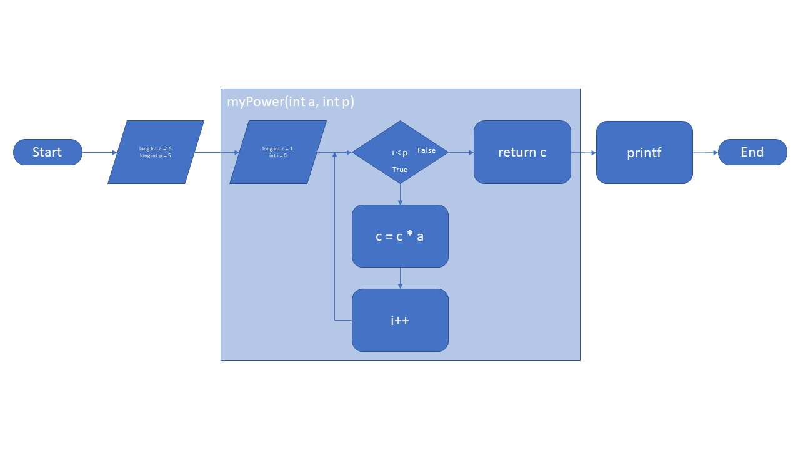
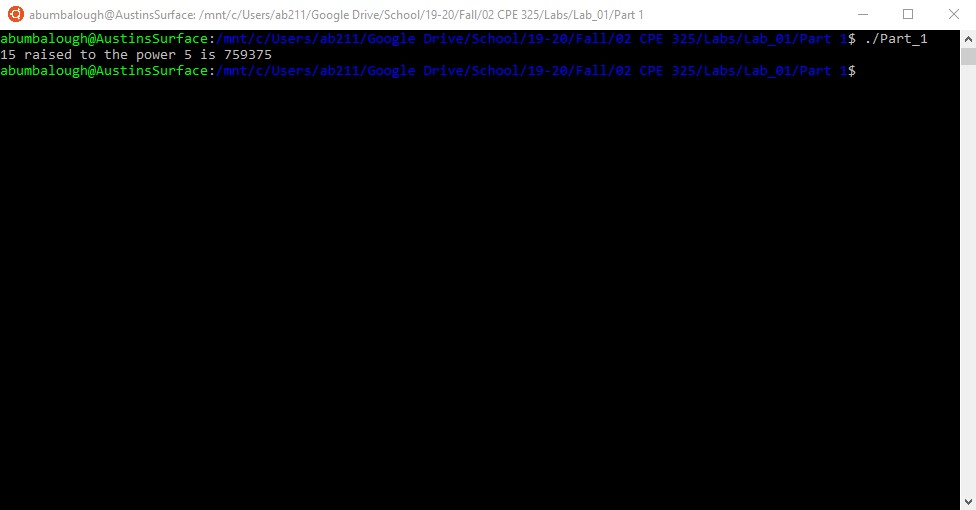
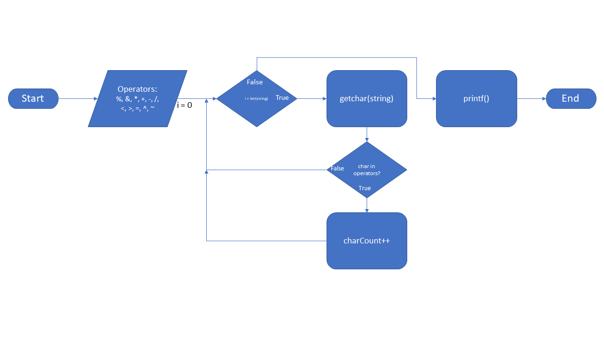
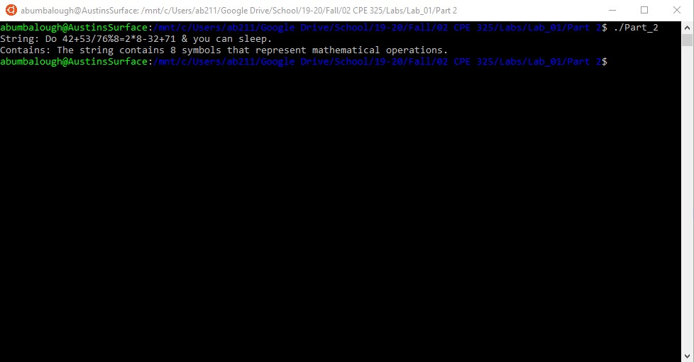

Austin Bumbalough  
CPE 325-08  
Lab 01  
08/27/2019  
# Lab 01 Solution 
--- 
## Part 1 Solution  
### Flow Diagram
  
---
### Console Output  
  
---
### Source Code  

```C
#include <msp430.h>
#include <stdio.h>

long int myPower(int, int) ;

int main(void)
{
	WDTCTL = WDTPW | WDTHOLD;	// stop watchdog timer
	
	// Declare parameter values
	int a = 2;
	int p = 11;
	long int c;

	c = myPower(a,p);

	printf("%d raised to the power %d is %ld\n", a, p ,c);

	return 0;
}

long int myPower(int a, int b) {
    long int c = 1;

    // c = 1 for case where b = 0
	// for all other cases, c = a^b
	for (int i=0; i<b; i++) {
        c *= a;
    }

    return c;
}
```

---
## Part 2 Solution  
### Flow Diagram
  
---
### Console Output  
    
---
### Source Code

```C
#include <msp430.h> 
#include <stdio.h>

int main(void)
{
	WDTCTL = WDTPW | WDTHOLD;	// stop watchdog timer
	
	// Define array of tokens to compare string against
	char operators[11] = {'%', '&', '*', '+', '-', '/', '<', '>', '=', '^', '~'};
	char testString[] = "Do 42+53$$76%8=2*8-32+71 & you can sleep.";
	
	// Declare variable to hold size of arrays for iteration boundary
	size_t opSize = sizeof(operators);
	size_t stringSize = sizeof(testString);

	// Initial counter variable
	int mathCharCount = 0;

    char currentChar;
	for (int i=0;i<stringSize;i++) {
		
		// Get character from string
	    currentChar = testString[i];

	    for (int j=0;j<opSize;j++) {
			
				// Compare current character to token
	            if (currentChar == operators[j]) {
	                // Increment counter if match is found
					mathCharCount++;
	            }
				
				// Repeat for all tokens
	        }
			
	// Repeat for all characters in string
	}

	printf("String: %s\n", testString);
	printf("Contains: The string contains %d symbols that represent mathematical operations.\n", mathCharCount);

	return 0;
}

```