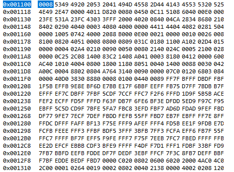
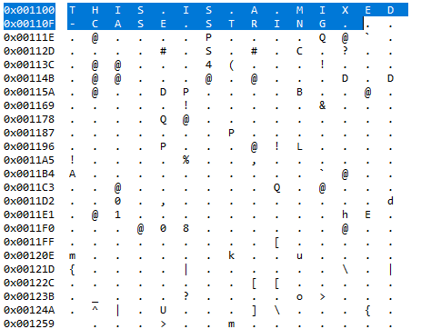

Austin Bumbalough  
CPE 325-08  
Lab 04  
09/23/2019  
# Lab 04 Solution  
## Part 1
In Lab 4 part 1, I created an assembly program to count the number of mathematical operators in the string "Do 42+53/76%8=2\*8-32+71 & you can sleep." The string is located at memory address 0x3100.  

  

After processing the string, the number of operator charcters is stored in a variable located in RAM at memory address 0x1100.  


### Source Code
```Assembly
            .cdecls C,LIST,"msp430.h"       ; Include device header file
            .align 2						; Align to words
            
testStr:	.cstring "Do 42+53/76%8=2*8-32+71 & you can sleep." ; Program input string

opChars:	.cstring "%&*+-/<>=^~"          ; Allocates 11 bytes for math operator characters
			.data
charCount:	.byte 0

;-------------------------------------------------------------------------------
            .def    RESET                   ; Export program entry-point to
                                            ; make it known to linker.
;-------------------------------------------------------------------------------
            .text                           ; Assemble into program memory.
            .retain                         ; Override ELF conditional linking
                                            ; and retain current section.
            .retainrefs                     ; And retain any sections that have
                                            ; references to current section.

;-------------------------------------------------------------------------------
RESET:       mov.w   #__STACK_END,SP         ; Initialize stackpointer
             mov.w   #WDTPW|WDTHOLD,&WDTCTL  ; Stop watchdog timer


;-------------------------------------------------------------------------------
; Main loop here
;-------------------------------------------------------------------------------

		clr.w SR 			; Clear status register
		clr.w R8 			; Clear R8 to store the matched character count

		mov.w #testStr, R4 		; Move address of first test string character into R4
getNext:	mov.w #opChars, R5 		; Move address of first operator character into R5
		mov.b @R4+, R6 			; Move next test character into R6 and increment R4 to next character address
		cmp.b #0, R6 			; Check if the current test character is the null character
		jeq stringEnd 			; If the current test character is null character, jump to program end
testOp:		mov.b @R5+, R7 			; Move next operator charcter into R7 and increment R5 to next operator character
		cmp.b #0, R7 			; Check if all operator characters have been tested
		jeq getNext 			; All operator characters have been compared to current test character
		cmp.b R6, R7 			; Check if current test character matches current operator character
		jne testOp 			; If not match, get next operator character and repeat
		inc.w charCount			; If the characters match, increment the counter register and
		jmp getNext 			; Get next operator charcter and repeat
stringEnd:	mov.w #charCount, R10		; Move memory address of counter variable to R10
		jmp $ 				; End of program, unconditional jump to current location


;-------------------------------------------------------------------------------
; Stack Pointer definition
;-------------------------------------------------------------------------------
            .global __STACK_END
            .sect   .stack
            
;-------------------------------------------------------------------------------
; Interrupt Vectors
;-------------------------------------------------------------------------------
            .sect   ".reset"                ; MSP430 RESET Vector
            .short  RESET

```
## Part 2
In lab 4 part 2, I created an assembly program to interpret a string containing a mathematical expression and evaluate the result. Valid operands are single digit numbers and valid operators are '+' and '-'. The result of evaluating the string "1+2+4-6" is displayed on the MSP 430 port 2.  

  
### Source Code
```Assembly
            .cdecls C,LIST,"msp430.h"       ; Include device header file
            .align 2						; Align to words
			
;-------------------------------------------------------------------------------
            .def    RESET                   ; Export program entry-point to
                                            ; make it known to linker.
											
;-------------------------------------------------------------------------------
; Program variables stored in RAM (.data)
;-------------------------------------------------------------------------------

evalString:	.cstring "1+2+4-6"
											
;-------------------------------------------------------------------------------
            .text                           ; Assemble into program memory.
            .retain                         ; Override ELF conditional linking
                                            ; and retain current section.
            .retainrefs                     ; And retain any sections that have
                                            ; references to current section.

;-------------------------------------------------------------------------------
RESET:       mov.w   #__STACK_END,SP         ; Initialize stackpointer
             mov.w   #WDTPW|WDTHOLD,&WDTCTL  ; Stop watchdog timer


;-------------------------------------------------------------------------------
; Main loop here
;-------------------------------------------------------------------------------

		clr.w SR 			; Clear status register
		clr.w R7 			; Clear result register R7
		clr.w R8 			; Clear operator flag register R8
		bis.b #0xFF, P2DIR 		; Set port 2 to output
		mov.w #evalString, R4 		; Move string start address to R4
		jmp getOperand

getOperator:	mov.b @R4+, R6 			; Get next Operator
		cmp.b #0, R6 			; Check for string end
		jeq printResult
		cmp.b #'+', R6 			; Check if operator is +
		jeq setAdd
		cmp.b #'-', R6 			; Check if operator is -
		jeq setSub
convOp:		cmp.b #'+', R6 			; Compare operator and set operation flag
		jeq setAdd
		cmp.b #'-', R6
		jeq setSub
setAdd:		mov.b #0, R8 			; Set operation flag to 0
		jmp getOperand
setSub:		mov.b #1, R8 			; Set operation flag to 1
		jmp getOperand
getOperand:	mov.b @R4+, R5 			; Move next operand to R5
charToDec:	cmp.b #'0', R5 			; Convert operand from ascii to decimal
		jeq ascii0
		cmp.b #'1', R5
		jeq ascii1
		cmp.b #'2', R5
		jeq ascii2
		cmp.b #'3', R5
		jeq ascii3
		cmp.b #'4', R5
		jeq ascii4
		cmp.b #'5', R5
		jeq ascii5
		cmp.b #'6', R5
		jeq ascii6
		cmp.b #'7', R5
		jeq ascii7
		cmp.b #'8', R5
		jeq ascii8
		cmp.b #'9', R5
		jeq ascii9
ascii0:		mov.b #0, R5
		jmp evaluate
ascii1:		mov.b #1, R5
		jmp evaluate
ascii2:		mov.b #2, R5
		jmp evaluate
ascii3:		mov.b #3, R5
		jmp evaluate
ascii4:		mov.b #4, R5
		jmp evaluate
ascii5:		mov.b #5, R5
		jmp evaluate
ascii6:		mov.b #6, R5
		jmp evaluate
ascii7:		mov.b #7, R5
		jmp evaluate
ascii8:		mov.b #8, R5
		jmp evaluate
ascii9:		mov.b #9, R5
		jmp evaluate
evaluate:	cmp #0, R8 			; Check operation flag and perform operation
		jeq regAdd
		cmp #1, R8
		jeq regSub
regAdd:		add.b R5, R7 			; Add R5 to R7
		jmp getOperator
regSub:		sub.b R5, R7 			; Subtract R5 from R7
		jmp getOperator
printResult:	mov.b R7, P2OUT 		; Display R7 on Port 2
		jmp $

;-------------------------------------------------------------------------------
; Stack Pointer definition
;-------------------------------------------------------------------------------
            .global __STACK_END
            .sect   .stack
            
;-------------------------------------------------------------------------------
; Interrupt Vectors
;-------------------------------------------------------------------------------
            .sect   ".reset"                ; MSP430 RESET Vector
            .short  RESET
```
## Part 3 (Bonus)
In lab 4 part 3, I created an assembly program to convert all lowercase characters in a string to uppercase. The input string is located in RAM at memory address 0x1100.  

  

The original string is modified such that the output string is stored at the same location.  

  
### Source Code
```Assembly
            .cdecls C,LIST,"msp430.h"       ; Include device header file
            .align 2						; Align to words
			
;-------------------------------------------------------------------------------
            .def    RESET                   ; Export program entry-point to
                                            ; make it known to linker.
											
;-------------------------------------------------------------------------------
; Program variables stored in RAM (.data)
;-------------------------------------------------------------------------------

			.data
testString:	.cstring "This is a Mixed-Case string."
											
;-------------------------------------------------------------------------------
            .text                           ; Assemble into program memory.
            .retain                         ; Override ELF conditional linking
                                            ; and retain current section.
            .retainrefs                     ; And retain any sections that have
                                            ; references to current section.

;-------------------------------------------------------------------------------
RESET:       mov.w   #__STACK_END,SP         ; Initialize stackpointer
             mov.w   #WDTPW|WDTHOLD,&WDTCTL  ; Stop watchdog timer


;-------------------------------------------------------------------------------
; Main loop here
;-------------------------------------------------------------------------------

		mov.w #testString, R4 		; Move string start address to R4
getNext:	mov.b @R4, R5 			; Move first character into R5
		cmp.b #0, R5 			; Check for string end
		jeq stringEnd
		cmp #97, R5 			; Check if R5 contains a lower case character
		jl incString
		cmp #123, R5
		jge incString
		sub.b #32, 0(R4) 		; Subtract 32 to convert lower case to upper case
		jmp incString
incString:	inc.w R4
		jmp getNext
stringEnd:	jmp $

;-------------------------------------------------------------------------------
; Stack Pointer definition
;-------------------------------------------------------------------------------
            .global __STACK_END
            .sect   .stack
            
;-------------------------------------------------------------------------------
; Interrupt Vectors
;-------------------------------------------------------------------------------
            .sect   ".reset"                ; MSP430 RESET Vector
            .short  RESET
```