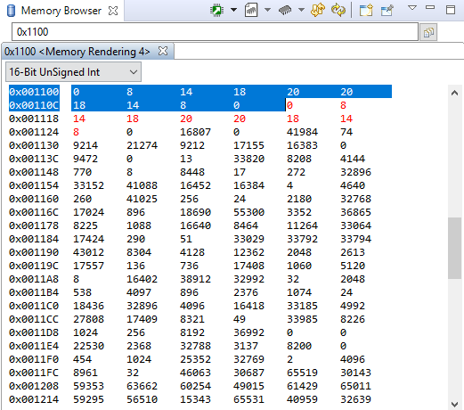
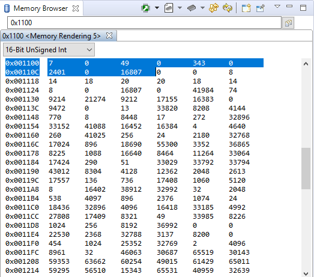
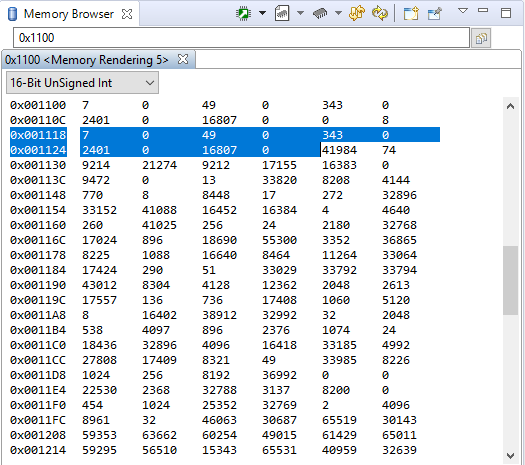

Austin Bumbalough  
CPE 325-08  
Lab 05  
10/01/2019  
# Lab 05 Solution  
## Part 1
In Lab 5 part 1, I wrote an assembly program to perform element-wise multiplication on two one-dimensional arrays and store the result in a third array. I implemented the multiplication using two seperate subroutines for software multiplication using shift and add algorithm, and hardware multiplication using MSP430 16-bit multiplier peripheral.  

The two input arrays are
```Assembly
arr1:	.int 0, 1, 2, 3, 4, 5, 6, 7, 8, 9
arr2:	.int 9, 8, 7, 6, 5, 4, 3, 2, 1, 0
```
Uninitialized space was allocated for two output arrays, software multiplication output and hardware multipliciation output.
``` Assembly
.bss arrOut_sw, 20, 2 ; Located at 0x1100
.bss arrOut_hw, 20, 2 ; Located at 0x1114
```
I used the processor stack to pass the input parameters and return values between the main function and the subroutines.
After running the program, the contents of the output arrays are: 

   
### Execution Time and Efficiency
The software emulated multiplication subroutine took 867 clock cycles to evaluate 10 elements, averaging approximately 87 cycles per element. At a speed of 1 MHz, the MSP430 can evaluate 11,494 elements per second using software-emulated multiplication.  

The hardware multiplication subroutine took 212 cycles to evaluate the same 10 elements, at an average of 22 cycles per element. At 1 MHz, the processor can evalute 45,454 elements per second.

The hardware multiplier is more efficient because it completes the exact same task in a quarter of the cycles required for software multiplication.
### Source Code
```Assembly
            .cdecls C,LIST,"msp430.h"       	; Include device header file
            
;-------------------------------------------------------------------------------
            .def    RESET                   	; Export program entry-point to
						; make it known to linker.
;-------------------------------------------------------------------------------
            .text                           			; Assemble into program memory.
            .retain                         			; Override ELF conditional linking
								; and retain current section.
            .retainrefs                     			; And retain any sections that have
								; references to current section.

arr1:			.int 0, 1, 2, 3, 4, 5, 6, 7, 8, 9	; Declare input array 1
arr2:			.int 9, 8, 7, 6, 5, 4, 3, 2, 1, 0	; Declare input array 2

			.bss arrOut_sw, 20, 2			; Allocate unitialized space 
			.bss arrOut_hw, 20, 2			; for output arrays

;-------------------------------------------------------------------------------
RESET:			mov.w   #__STACK_END,SP         ; Initialize stackpointer
			mov.w   #WDTPW|WDTHOLD,&WDTCTL  ; Stop watchdog timer
;-------------------------------------------------------------------------------
; Main loop here
;-------------------------------------------------------------------------------
			mov.b #10, R4 		; Number of array elements
			mov.w #arr1, R5 	; Starting address of input array 1
			mov.w #arr2, R6 	; Starting address of input array 2
			mov.w #arrOut_sw, R7	; Starting address of output arrays
			mov.w #arrOut_hw, R8	;
			push R4 		;
			push R5 		;
			push R6 		;
			push R7 		;
			call #SW_product
			add.w #8, SP		; Collapse stack after subroutine execution
			mov.b #10, R4		;
			mov.w #arr1, R5		; Reload program for hardware multiplication
			mov.w #arr2, R6		;
			push R4			;
			push R5			;
			push R6			;
			push R8			;
			call #HW_product
			add.w #8, SP		; Collapse stack after subroutine execution
			
progEnd:		jmp $ 			; End of program
;-------------------------------------------------------------------------------
; SW_Multiply Subroutine - Only supports up to 8-bit multiplication
;-------------------------------------------------------------------------------
SW_product:		push R9			; Save current program state
			push R10
			push R11
			push R12
						; Retrieve parameters from stack
			mov.w 16(SP), R4 	; Array length
			mov.w 14(SP), R5	; arr1 address
			mov.w 12(SP), R6	; arr2 address
			mov.w 10(SP), R7	; arrOut address
getNext:		clr.w R12
			mov.w @R5+, R9 		; Get next operands
			mov.w @R6+, R10		; -
			sxt R9 			; Sign extend the operands
			sxt R10			; -
			mov.b #8, R11 		; Use R11 as loop counter
mul_loop:		bit.w #1, R10		; Test bit 0 of R10
			jz shift
			add.w R9, R12
shift:			rla.w R9
			rra.w R10
			dec.w R11
			jnz mul_loop
			bit.w #1, R10
			jz mul_end
			inv.w R9		; 2's complement of R9
			add.w #1, R9
			add.w R9, R12
mul_end:		mov.w R12, 0(R7)
			add.w #2, R7		; Point arrOut to the next element
			dec.w R4 		; Decrement loop counter
			jnz getNext
			pop R12			; Collapse stack and 
			pop R11			; return from subroutine
			pop R10
			pop R9
			ret			
;-------------------------------------------------------------------------------
; HW_Multiply Subroutine
;-------------------------------------------------------------------------------
HW_product:		push R9
			push R10
			mov.w 12(SP), R4 	; Array length
			mov.w 10(SP), R5 	; arr1 address
			mov.w 8(SP), R6 	; arr2 address
			mov.w 6(SP), R8 	; arrOut address
loop:			mov.w @R5+, R9		; Get operands
			mov.w @R6+, R10		; -
			mov.b R9, &MPYS 	; Load first operand - Use signed multiply mode
			mov.b R10, &OP2 	; Load second operand
			mov.w &RESLO, 0(R8) 	; Store result in arrOut
			add.w #2, R8
			dec.w R4
			jnz loop
			pop R10 		; Collapse stack and
			pop R9			; return from subroutine
			ret
;-------------------------------------------------------------------------------
; Stack Pointer definition
;-------------------------------------------------------------------------------
            .global __STACK_END
            .sect   .stack
            
;-------------------------------------------------------------------------------
; Interrupt Vectors
;-------------------------------------------------------------------------------
            .sect   ".reset"                ; MSP430 RESET Vector
            .short  RESET
```
## Part 2 (Bonus)
In Lab 5 part 2, I created an assembly program to compute the first five powers of a given positive integer base.
Since the assignment states that results are assumed to be no longer than 16 bits, we are restricted to 8-bit multiplication. Thus, valid inputs would be 1, 2, and 3. By extending the program to support 16-bit multiplication, valid inputs are integers between 1 and 8. Again, the resulting arrays are stored in memory. Since the program supports 16-bit multipliction, results in the output arrays are double words (4 bytes in length).
  
The contents of memory after running with input base 7 and using software-emulated multiplication are:  

  

and with hardware multiplication the contents are:  

  
### Source Code
```Assembly
            .cdecls C,LIST,"msp430.h"       		; Include device header file
            
;-------------------------------------------------------------------------------
            .def    RESET				; Export program entry-point to
							; make it known to linker.
;-------------------------------------------------------------------------------
            .text					; Assemble into program memory.
            .retain					; Override ELF conditional linking
							; and retain current section.
            .retainrefs					; And retain any sections that have
							; references to current section.
											
			.bss power_sw, 20, 2		; Allocate unitialized space for outputs
			.bss power_hw, 20, 2		;
;-------------------------------------------------------------------------------
RESET:			mov.w   #__STACK_END,SP		; Initialize stackpointer
			mov.w   #WDTPW|WDTHOLD,&WDTCTL  ; Stop watchdog timer
;-------------------------------------------------------------------------------
; Main loop here
;-------------------------------------------------------------------------------
			mov.w #power_sw, R14	; Load result address to register
			mov.w #power_hw, R15	;
			mov.w #5, R4		; Power
			mov.w #7, R5		; Base low word
			mov.w #0, R6 		; Base high word
			add.w #16, R14		;
			add.w #20, R15      	;
main_loop:		push R4			; Pass exponent on stack
			push R5			; Pass base on stack
			push R6			; -
			push R7			; Pass space for return value on stack
			push R8			; -			
			call #power_sp		;
			pop R8			; Pop return value from stack
			pop R7			; -
			add.w #6, SP		; Collapse stack after subroutine return
			
;-------------------------------------------------------------------------------
; Uncomment this block for Software Multiply
;-------------------------------------------------------------------------------		
			mov.w R7, 0(R14)	; Store result in memory
			mov.w R8, 2(R14)	; -
			add.w #-4, R14		; Decrement result pointer
;-------------------------------------------------------------------------------

;-------------------------------------------------------------------------------
; Uncomment this block for Hardware Multiply
;-------------------------------------------------------------------------------
;			mov.w R7, 0(R15)	; Store result in memory
;			mov.w R8, 2(R15)	; -
;			add.w #-4, R15		; Decrement result pointer
;-------------------------------------------------------------------------------

			dec.w R4		; Decrement exponent
			jnz main_loop		;
loop_end:		jmp $				; End of program
;-------------------------------------------------------------------------------
; Power Subroutine
;-------------------------------------------------------------------------------
power_sp:		push R4			; Save program state
			push R5			;
			push R6			;
			push R7			;
			push R8			;
			mov.w 20(SP), R4	; Retrieve loop counter from stack
			mov.w 18(SP), R5	; Retrieve OP1 LB
			mov.w 16(SP), R6	; Retrieve OP1 UB
			mov.w #1, R7		; Retrieve OP2 LB
			mov.w #0, R8		; Retrieve OP2 UB
power_loop:		push R5			; Pass OP1 on stack
			push R6			; -
			push R7			; Pass OP2 on stack
			push R8			; -
;-------------------------------------------------------------------------------
; Uncomment this block for Software Multiply
;-------------------------------------------------------------------------------
			call #swMult		;
			pop R8			; Pop return value from stack
			pop R7			; -
;-------------------------------------------------------------------------------

;-------------------------------------------------------------------------------
; Uncomment this block for Hardware Multiply
;-------------------------------------------------------------------------------
;			call #hwMult		;
;			pop R8			; Pop return value from stack
;			pop R7			; -
;-------------------------------------------------------------------------------

			add.w #4, SP		; Collapse stack after subroutine return
			dec.w R4		; Decrement loop counter
			jnz power_loop		;
power_end:		mov.w R7, 14(SP)	; Return result on stack
			mov.w R8, 12(SP)	; -
			pop R8			; Restore program state
			pop R7			;
			pop R6			;
			pop R5			;
			pop R4			;
			ret			;
;-------------------------------------------------------------------------------
; SW_Multiply Subroutine - Only supports up to 16-bit multiplication
;-------------------------------------------------------------------------------
swMult:			push R4			; Save program state
			push R5			;
			push R6			;
			push R7			;
			push R8			;
			push R9			;
			push R10		;
			clr.w R9		;
			clr.w R10       	;
			mov.w #16, R4		; 
			mov.w 22(SP), R5	; Retrieve OP1 LB from stack
			mov.w 20(SP), R6	; Retrieve OP1 UB
			mov.w 18(SP), R7	; Retrieve OP2 LB
			mov.w 16(SP), R8	; Retrieve OP2 UB
mul_loop:	bit.w #1, R7			; Test R7 bit 0
			jz shift		;
			add.w R5, R9		; 16-bit add
			addc.w R6, R10		; -
shift:		rla.w R5			; 16-bit left shift
			rlc.w R6		; -
			rra.w R7		; 16-bit right shift
			rrc.w R8		; -
			dec.w R4		;
			jnz mul_loop		;
			bit.w #1, R7		; Test R7 bit 0
			jz mul_end		;
			inv.w R5		; 16-bit 2's complement
			inv.w R6		; -
			add.w #1, R5		; -
			addc.w #0, R6		; -
			add.w R5, R9		; 16-bit add
			addc.w R6, R10		; -
mul_end:	mov.w R9, 18(SP)		; Return result on stack
			mov.w R10, 16(SP)	; -
			pop R10			; Restore program state
			pop R9			;
			pop R8			;
			pop R7			;
			pop R6			;
			pop R5			;
			pop R4			;
			ret			;
;-------------------------------------------------------------------------------
; HW_Multiply Subroutine
;-------------------------------------------------------------------------------
hwMult:			mov.w 8(SP), &MPYS	; 16-bit signed multiply mode
			mov.w 4(SP), &OP2	;
			mov.w &RESLO, 4(SP)	;
			mov.w &RESHI, 2(SP)	;
			ret			;
;-------------------------------------------------------------------------------
; Stack Pointer definition
;-------------------------------------------------------------------------------
            .global __STACK_END
            .sect   .stack

;-------------------------------------------------------------------------------
; Interrupt Vectors
;-------------------------------------------------------------------------------
            .sect   ".reset"                ; MSP430 RESET Vector
            .short  RESET

```

```
----------------------------------------------------------
 _ )               |            |                     |   
 _ \  |  |   ` \    _ \   _` |  |   _ \  |  |   _` |    \ 
___/ \_,_| _|_|_| _.__/ \__,_| _| \___/ \_,_| \__, | _| _|
					      ____/         
----------------------------------------------------------
```