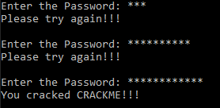

Austin Bumbalough  
CPE 325-08  
Lab 11  
11/18/2019  
# Lab 11 Solution 

## Part 1 Solution
In Lab 11 Part 1, I used the gcc strings utility to extract the strings in the Austin-T-Bumbalough.out file. After examining the strings, I found a section that seemed like it may contain the password.
```
You cracked CRACKME!!!
Please try again!!!
Enter the Password: 
36aac0573cfb
f89cb44545c5
0b2dabba4183
bf367b52093b
8349006c8080
5d4ced15d1d6
```

After trying each of the 5 potential password strings, I cracked the program using the password **5d4ced15d1d6**.

### UART Output



## Part 2 Solution
The first step in the Lab 11 part 2 solution is to use the naken_util disassembly mode on the provided reverseEngineerMe.txt file to convert the hex file into assembly.

### Naken_util Output
```Assembly
Addr    Opcode Instruction                              Cycles
------- ------ ----------------------------------       ------
0x3100: 0x40b2 mov.w #0x5a80, &0x0120                   5
0x3102: 0x5a80
0x3104: 0x0120
0x3106: 0xd2e2 bis.b #4, &0x002e                        4
0x3108: 0x002e
0x310a: 0x40b2 mov.w #0x00e0, &0x0184                   5
0x310c: 0x00e0
0x310e: 0x0184
0x3110: 0x40b2 mov.w #0x0210, &0x0180                   5
0x3112: 0x0210
0x3114: 0x0180
0x3116: 0x40b2 mov.w #0x03e7, &0x0192                   5
0x3118: 0x03e7
0x311a: 0x0192
0x311c: 0x40b2 mov.w #0x031f, &0x0194                   5
0x311e: 0x031f
0x3120: 0x0194
0x3122: 0xb3d2 bit.b #1, &0x0020                        4
0x3124: 0x0020
0x3126: 0x2003 jne 0x312e  (offset: 6)                  2
0x3128: 0xc2e2 bic.b #4, &0x002a                        4
0x312a: 0x002a
0x312c: 0x3ffa jmp 0x3122  (offset: -12)                2
0x312e: 0xd2e2 bis.b #4, &0x002a                        4
0x3130: 0x002a
0x3132: 0x3ff7 jmp 0x3122  (offset: -18)                2
0x3134: 0x4031 mov.w #0x3100, SP                        2
0x3136: 0x3100
0x3138: 0x12b0 call #0x314e                             5
0x313a: 0x314e
0x313c: 0x430c mov.w #0, r12                            1
0x313e: 0x12b0 call #0x3100                             5
0x3140: 0x3100
0x3142: 0x431c mov.w #1, r12                            1
0x3144: 0x12b0 call #0x3148                             5
0x3146: 0x3148
0x3148: 0x4303 nop   --  mov.w #0, CG                   1
0x314a: 0x3fff jmp 0x314a  (offset: -2)                 2
0x314c: 0x4303 nop   --  mov.w #0, CG                   1
0x314e: 0x431c mov.w #1, r12                            1
0x3150: 0x4130 ret   --  mov.w @SP+, PC                 3
0x3152: 0xd032 bis.w #0x0010, SR                        2
0x3154: 0x0010
0x3156: 0x3ffd jmp 0x3152  (offset: -6)                 2
0x3158: 0x4303 nop   --  mov.w #0, CG                   1
```

### Reverse-Engineered Program Description
The first operation that this program performs is stopping the watchdog timer by writing 0x5A80 to the WDTCTL register @ 0x0120. The next instruction sets bit 2 of the P2SEL register to logic 1. The selects TimerB1 output on P2.2 (connected to LED1). Next, 0x00e0 is written to TBCCTL1 register configuring TimerB1 Output 1 to Reset/set mode. After writing 0x0210 to TBCTL, TimerB is configured with TBCLK=SMCLK, up mode, and interrupts disabled. Next, the count up max value, 0x03E7 (decimal 1015) is written to TBCCR0. In the next instruction, TBCCR1 is set to 0x031F (decimal 799). The resulting TimerB configuration creates a PWM signal with 79% duty cycle (799/1015).  

After the Timer Configuration, the next line polls bit 0 of P1IN (SW1). If bit 0 is high bit 2 of P2DIR is cleared, stopping any output on P2.2. Otherwise, if bit 0 is low, the program jumps back and polls bit 0 of P1IN. After analyzing the assembly file, we can conclude that this program drives LED1 with a 79% duty signal while SW! is pressed, and turns of the LED when SW1 is not pressed.